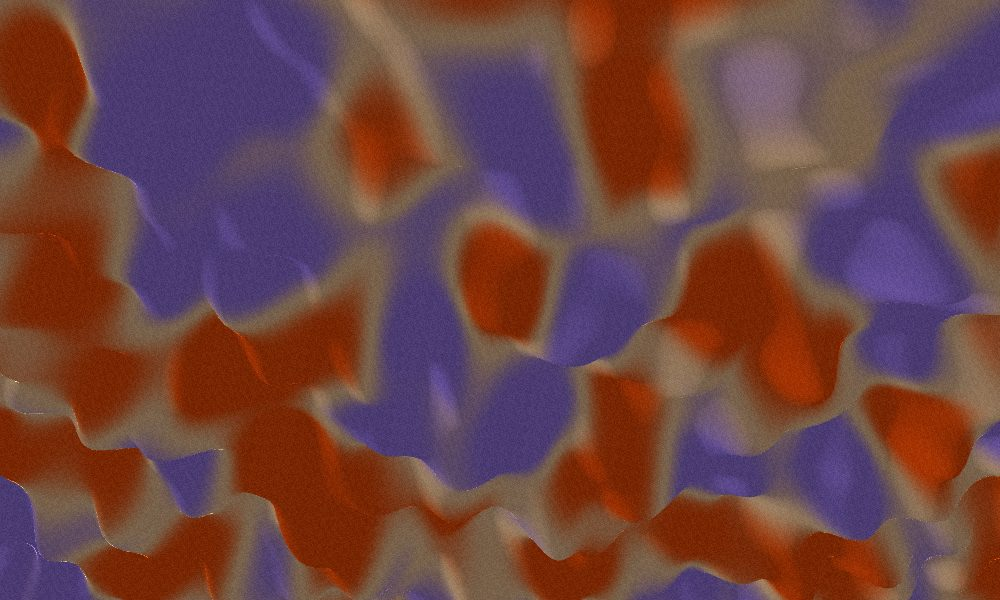
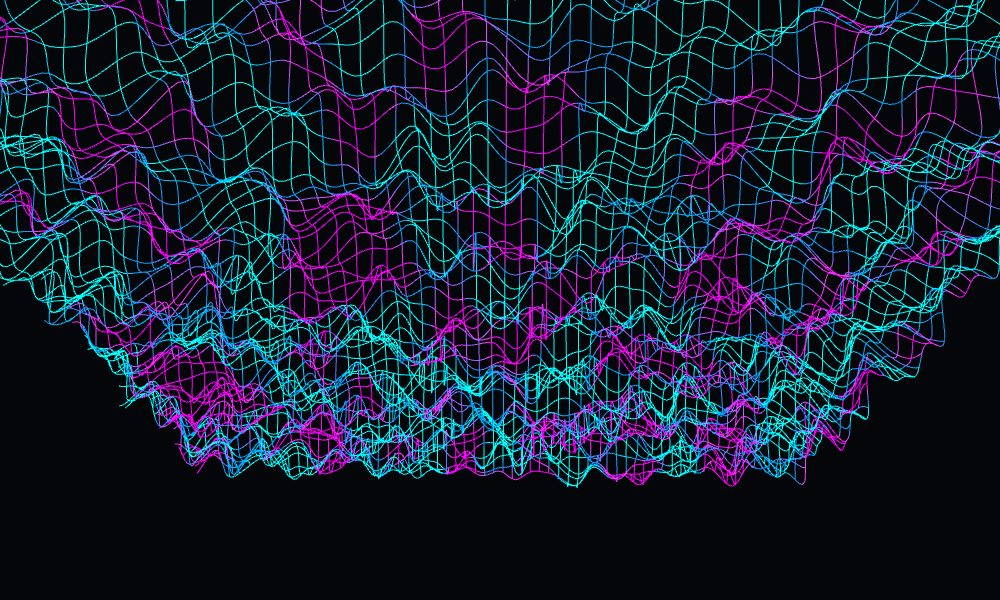
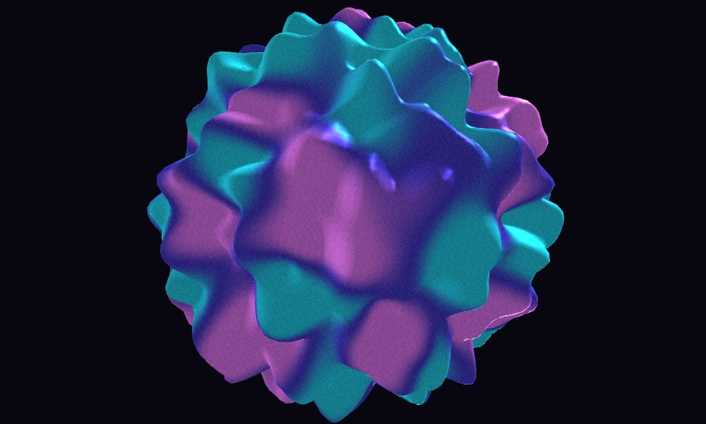
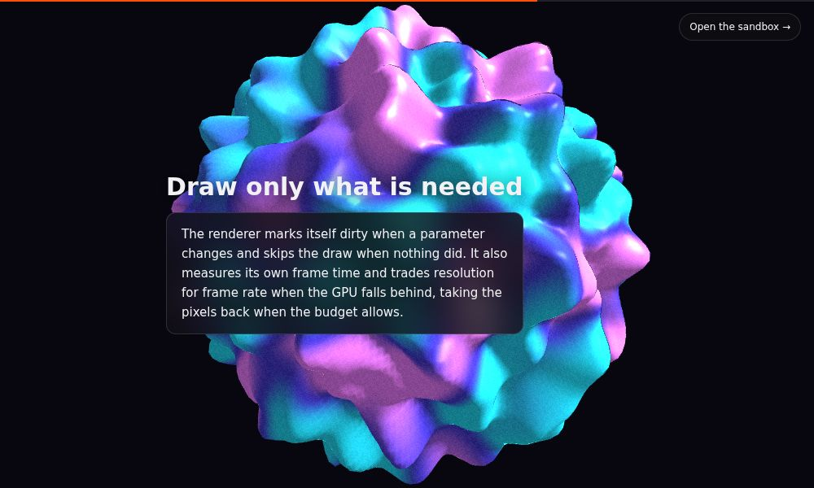

# Shader Gradient Exploration

A dependency-free WebGL2 study of the animated mesh gradients popularised by
[ShaderGradient](https://shadergradient.co/) — a noise-displaced mesh, three
colours mixed across it, lit and grained, driven live from a control panel.

Nothing here is compiled or installed: no bundler, no npm packages, no
`three.js`. The shaders, geometry, matrix math and UI are all in `src/`.



| Wireframe | Sphere |
| --- | --- |
|  |  |

Two pages share the renderer: `index.html` is the sandbox with the control
panel, and `scroll.html` is a scroll-driven rig that walks the same parameters
through four keyframes as you read down the page.



## Run it

ES modules need a real origin, so open it through any static server:

```bash
python3 -m http.server 8000
# then visit http://localhost:8000
```

## Using it

- **Drag** the canvas to orbit, **scroll** to dolly in and out.
- **Space** pauses and resumes the animation, **h** hides the panel.
- **Presets** — Halo, Lagoon, Orbit, Dune, Mesh — are starting points, not modes.
- **Copy link** puts the current settings in a URL; the address bar tracks every
  change as you make it, so a reload never loses a look you liked.
- **Save PNG** grabs the current frame at the canvas' device resolution.

## Scroll rig

`scroll.html` keeps the canvas fixed behind scrolling copy and maps scroll
position onto a path through four keyframes. Continuous values interpolate;
discrete ones — mesh type, light rig, grain — step at the midpoint between two
keyframes, since there is no halfway between a sphere and a plane. The eased
position chases the raw scroll offset exponentially, so the delay feels the same
at 30fps and at 144Hz.

The rig owns every parameter it names for the whole page, and nothing else
writes them. That is the point: the usual mess in a scroll-driven 3D scene is
two animators writing the same camera and neither winning.

## Parameters

Names follow [`@shadergradient/react`](https://github.com/ruucm/shadergradient)
so settings read the same way, though the value ranges are tuned to this
renderer's own scale. Every one is a query parameter; only non-defaults appear
in the URL.

| Parameter | Values | Notes |
| --- | --- | --- |
| `type` | `plane`, `sphere`, `waterPlane` | `waterPlane` adds a travelling wave on top of the noise |
| `animate` | `on`, `off` | `off` freezes time; the mesh still responds to the sliders |
| `uSpeed` | 0–2 | Time scale of the noise field |
| `uStrength` | 0–2 | Displacement along the surface normal |
| `uDensity` | 0.05–4 | Spatial frequency of the noise |
| `uFrequency` / `uAmplitude` | 0–8 / 0–2 | Wave term, `waterPlane` only |
| `wireframe` | `true`, `false` | Draws grid lines instead of a filled surface |
| `color1` / `color2` / `color3` | hex | Ramp stops, low to high |
| `bgColor` | hex | Clear colour behind the mesh |
| `positionX/Y/Z` | -6–6 | Mesh translation |
| `rotationX/Y/Z` | -180–180 | Mesh rotation, degrees |
| `cAzimuthAngle` / `cPolarAngle` | 0–360 / 1–179 | Orbit camera, degrees |
| `cDistance` / `cameraZoom` | 1–20 / 0.4–3 | Dolly distance and field of view |
| `lightType` | `3d`, `env` | Two-light rig, or a hemisphere environment |
| `envPreset` | `city`, `dawn`, `lobby` | Sky and bounce colours for `env` |
| `brightness` / `reflection` | 0–3 / 0–1 | Exposure and specular weight |
| `grain` / `grainBlending` | `on`, `off` / 0–0.6 | Per-pixel film grain |

## How it works

**Displacement.** A 200×200 grid (or UV sphere) is uploaded once and never
touched again; every frame the vertex shader offsets each vertex along its
normal by a 3D simplex noise sample whose third axis is time. `waterPlane` adds
a `sin`/`cos` wave so the surface reads as swell rather than terrain.

**Normals.** Displacing vertices invalidates the normals that came with the
geometry, so the shader samples the displaced surface three times — at the
vertex and one step along its tangent and bitangent — and takes the cross
product of the two edges. That is why each vertex carries a tangent: on a sphere
there is no canonical one to guess.

**Colour.** A second, slower noise field drives a 0–1 mix value, put through a
`smoothstep` so the ramp doesn't spend most of its area on the middle colour,
then run through two overlapping `smoothstep` blends across the three stops.
The result is shaded (Lambert plus a specular lobe, or a hemisphere ambient for
`env`) and finished with hash-based grain in screen space.

**Frame cost.** All the motion lives in the vertex shader — no buffers are
re-uploaded and no geometry is rebuilt when a slider moves, so a parameter
change is just a uniform write. Rendering stops entirely while the tab is
hidden.

**Drawing on demand.** With animation off, a frame is drawn only after something
marks the view dirty — a parameter change, a resize — rather than every 16ms.
The loop also averages its own frame time over 30 frames and scales the drawing
buffer down (to 55% at worst) when it can't hold the budget, taking the pixels
back when it can. On a software rasteriser the scale settles around 0.7; on a
real GPU it stays at 1.

**Teardown.** `ShaderGradient#dispose()` deletes the buffers, vertex arrays and
program it created — unbinding the program first, or `deleteProgram` merely
flags it while it is still current. Both pages register their listeners against
one `AbortController` and dispose on `pagehide`.

## Layout

```
index.html        sandbox page shell
scroll.html       scroll-driven rig page
style.css         panel, canvas and scroll-page styling
src/main.js       sandbox wiring: controls, URL state, pointer and keyboard input
src/scroll.js     scroll rig: keyframes, easing, one owner per parameter
src/gradient.js   renderer — meshes, uniforms, camera, draw loop
src/shaders.js    GLSL sources
src/geometry.js   plane, sphere and wireframe index generation
src/gl.js         program compilation and 4×4 matrix helpers
src/params.js     parameter schema, defaults, presets, query-string round trip
src/ui.js         control panel construction
```

## Notes

Requires WebGL2 (every current browser); the page says so plainly instead of
rendering nothing if the context is unavailable. The simplex noise
implementation is the webgl-noise port by Ashima Arts and Stefan Gustavson,
MIT licensed. This is an independent implementation of the idea — no
ShaderGradient code is used or vendored here.
